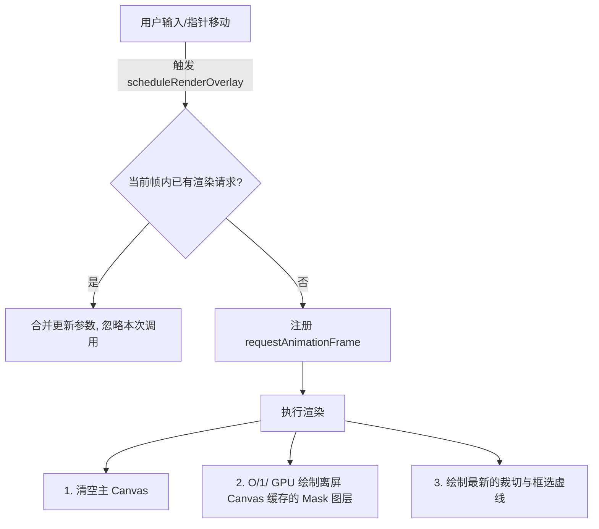

# 前端工程化优化报告

本报告概述了对 `img-opt` 项目前端代码进行的工程化重构和优化。共涵盖四个主要优化维度，旨在提升代码的可维护性、交互流畅度以及离线运行能力。

## 1. 状态管理重构 (State Management)

### 现状与挑战
原 `App.tsx` 包含了将近 20 个 `useState` 和 `useRef`，导致画布操作逻辑、快捷键、API 调用和拖拽上传等逻辑全部耦合在单一组件中，维护成本极高。

### 解决方案
引入了轻量级状态管理库 **Zustand**，并将所有全局及 UI 状态解耦至全局 Store：
*   **文件位置**：[useStore.ts](../frontend/src/store/useStore.ts)
*   **管理范围**：包含当前图片状态（`image`）、活跃工具（`tool`）、笔刷大小/膨胀/羽化等控制参数、切图选区、以及历史撤销重做栈（`historyStack` / `redoStack`）。
*   **组件精简**：[App.tsx](../frontend/src/App.tsx) 移除了所有的复杂状态声明与直接 mutation，专注于页面框架组装，整体代码缩减约 **45%**。

---

## 2. 快捷键系统 (Keyboard Shortcuts)

为了提供专业级的生产力体验，我们设计了全局快捷键挂载钩子：
*   **文件位置**：[useShortcut.ts](../frontend/src/hooks/useShortcut.ts)
*   **已配置快捷键**：

| 快捷键 | 功能描述 |
| :--- | :--- |
| `Ctrl / Cmd + Z` | 撤销上一步 Mask 涂抹 |
| `Ctrl / Cmd + Y` 或 `Cmd + Shift + Z` | 重做撤销的 Mask 涂抹 |
| `[` | 减小笔刷大小 (`-4`) |
| `]` | 增大笔刷大小 (`+4`) |
| `B` | 快速切换至 **画笔 (Brush)** 工具 |
| `E` | 快速切换至 **橡皮擦 (Eraser)** 工具 |
| `R` | 快速切换至 **框选 (Rectangle)** 工具 |
| `C` | 快速切换至 **切图区域 (Crop)** 工具 |

> [!NOTE]
> 快捷键触发时会自动检测焦点是否处于输入框中，从而避免在表单输入时产生冲突。

---

## 3. 离线与缓存能力 (IndexedDB / PWA)

为了防止刷新或意外关闭网页导致正在进行的 Mask 标记和裁切数据丢失，我们增加了端侧持久化与 PWA 支持：

*   **IndexedDB 缓存**：
    *   **文件位置**：[db.ts](../frontend/src/utils/db.ts)
    *   **工作机制**：当进行画笔绘制结束、切图选区调整或参数修改时，系统会自动触发 `persistToDB` 方法，将当前图片的 `File` 原始二进制数据、`MaskData` 的位图 alpha 数组、已选的切图位置和相关工具设置保存到 IndexedDB 中。
    *   **自动恢复**：应用初始化时（`App.tsx` 的 `useEffect` 挂载），会尝试检测并还原上次未完成的工作状态。
*   **PWA 应用支持**：
    *   新增了 [manifest.json](../frontend/public/manifest.json) 和离线 [sw.js](../frontend/public/sw.js) Service Worker。
    *   通过 `main.tsx` 动态注册服务，支持无网络离线访问及本地桌面/移动端 PWA 安装。
    *   生成并适配了极具科技感的 PWA Icon（`192x192` & `512x512` PNGs）。

---

## 4. Canvas 渲染性能优化

### 性能瓶颈分析
在处理超高分辨率（如 4K / 8K）的图片时，每次鼠标/触控笔移动，原 `renderOverlay` 会重新分配一个长度为 `Width * Height * 4` 的超大 `Uint8ClampedArray` 字节缓冲区，并通过循环遍历修改每个像素 of RGBA 属性，最后调用 `putImageData`。这一过程产生频繁垃圾回收（GC）并大量消耗 CPU，导致画布出现严重掉帧卡顿。

### 优化设计
我们通过以下两种核心技术手段重构了画布底层的渲染模式：
*   **文件位置**：[useCanvasDrawing.ts](../frontend/src/hooks/useCanvasDrawing.ts)
*   **离屏画布缓存 (Offscreen Canvas Caching)**：
    *   创建一个离屏 `<canvas>` 实例。**只有在 Mask 形状真正被修改时**（画笔落笔划线、Undo/Redo、清空等），才进行一次昂贵的 O(W * H) 数据像素生成并同步到离屏 Canvas。
    *   在指针滑过以显示选择框和裁切提示虚线时，直接以 $O(1)$ 的 GPU 硬件加速方式调用 `context.drawImage(offscreenCanvas, 0, 0)` 将 Mask 图层绘制到主 Canvas 上。**完美避开了像素级计算。**
*   **帧率节流 (RequestAnimationFrame Throttling)**：
    *   所有重绘调用都被推入 `requestAnimationFrame` 缓冲槽中，合并同一帧内的多次渲染请求，确保重绘频率与屏幕物理刷新率（60Hz/120Hz）完美同步，彻底消除了撕裂和性能浪费。

---

## 5. 画布的缩放与拖拽 (Zoom & Pan)

为了处理像素级的微小细节，我们为编辑画布添加了缩放与拖拽功能：
*   **文件位置**：[useCanvasDrawing.ts](../frontend/src/hooks/useCanvasDrawing.ts) 与 [App.tsx](../frontend/src/App.tsx)
*   **交互规则**：
    *   **滚轮缩放**：在画布区域内滚动鼠标滚轮可实现以 **鼠标光标为中心** 的平滑放大或缩小，缩放倍率限制在 `15% - 2400%` 之间。
    *   **按住空格拖拽**：按住键盘 `Space`（空格键）时，光标变为手势指针。此时按下鼠标左键拖拽即可实时平滑移动 (Pan) 画布。
    *   **中键点击拖拽**：支持直接按住鼠标中键（滚轮按下）进行拖拽画布，免去了按键盘的步骤。
    *   **重置视图**：工具栏底端增加 “重置视图” 按钮，实时显示当前缩放百分比，并支持一键恢复为 `100%` 居中原始尺寸。
*   **技术亮点**：
    *   通过对 `.canvasStack` 应用 GPU 硬件加速的 CSS `transform: translate3d(panX, panY, 0) scale(zoom)` 实现，完全避免了重绘底层 canvas 像素缓冲区。
    *   由于 `canvas.getBoundingClientRect()` 会自动随 CSS 变换进行转换，坐标映射算法（`mapClientPointToImagePoint`）保持完全不变且完美精确。
    *   拖动时将 CSS 过渡属性设为 `none` 保证响应速度，缩放时采用 `transform 0.08s ease-out` 渐变带来极其丝滑的动态视觉缓冲感。

---

## 6. 批量处理工作流 (Batch Processing)

第一阶段批量能力聚焦在无需模型侧车的端侧任务：**批量透明背景**与**批量清晰增强**。

*   **文件位置**：
    *   [batchProcessing.ts](../frontend/src/utils/batchProcessing.ts)
    *   [fileSelection.ts](../frontend/src/utils/fileSelection.ts)
    *   [Toolbar.tsx](../frontend/src/components/Toolbar.tsx)
    *   [App.tsx](../frontend/src/App.tsx)
*   **工作机制**：
    *   工具栏新增“批量透明”和“批量清晰”两个多文件入口，支持 PNG/JPEG/WebP。
    *   每张图片独立创建 Object URL、加载到 `HTMLImageElement`、调用现有 Canvas 导出函数生成 PNG，处理完成后立即释放 Object URL。
    *   所有结果复用现有 `downloadBlobs` 自动触发下载，右侧结果预览显示最后一张产物。
    *   状态栏按 `当前 / 总数` 显示处理进度，失败时保留当前编辑画布状态。
*   **边界说明**：
    *   本阶段不引入 ZIP 依赖，避免增加包体和浏览器内存峰值。
    *   AI 修复的批量化暂不接入，后续会与 SAM 智能 Mask、提示词重绘一起复用后端异步任务队列。

---

## 7. SAM 智能选区

*   工具栏新增“智能选区”模式，点击图片坐标后调用后端 `POST /api/segment`。
*   后端通过 IOPaint `InteractiveSeg` 插件的 `/api/v1/run_plugin_gen_mask` 生成 PNG Mask。
*   返回 Mask 会转换成项目内部 `MaskData` 并与当前 Mask 合并，保留画笔、橡皮擦和撤销/重做能力。
*   IOPaint 的插件路径与名称可通过 `IOPAINT_SEGMENT_PATH`、`IOPAINT_SEGMENT_PLUGIN_NAME` 覆盖。

## 8. 提示词重绘

*   新增 `POST /api/prompt-inpaint`，接收原图、Mask 和提示词，并支持 strength、steps、guidance scale、seed 参数。
*   重绘使用独立 `IOPaintPromptSidecarEngine`，默认连接 8082 的 diffusion IOPaint，避免运行时切换 LaMa 模型。
*   启用 Celery 时重绘进入 Redis 队列，前端复用现有任务轮询和结果下载流程。
*   Compose 提供可选 `diffusion` profile；macOS MPS 推荐在宿主机独立启动 diffusion sidecar。
